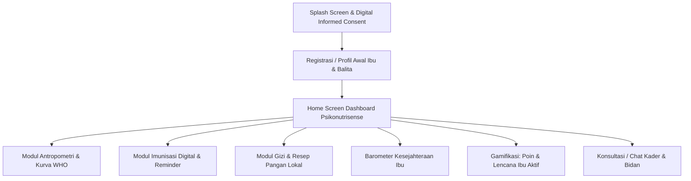

# **PRODUCT REQUIREMENTS DOCUMENT (PRD)**
# **PLATFORM DIGITAL "PSIKONUTRISENSE"**

**Versi:** 1.0.0  
**Tanggal:** 20 September 2026  
**Status:** Approved  
**Fokus Lokasi:** Kelurahan Ngeposari (Percepatan Penurunan Stunting Berbasis Pangan Lokal & Intervensi Terpadu)  
**Target Pengguna Utama:** Ibu yang memiliki balita usia 0–5 tahun  
**Referensi Standar Data:** Buku KIA (Kesehatan Ibu dan Anak) Kemenkes RI Terbaru  

---

## **1. EXECUTIVE SUMMARY & OBJECTIVES**

### **1.1 Latar Belakang**
Stunting pada balita tidak hanya dipengaruhi oleh asupan gizi makro dan mikro, tetapi juga berkaitan erat dengan kondisi emosional dan psikososial pengasuh (ibu), pengetahuan gizi, kepatuhan imunisasi, serta ketersediaan pangan lokal. **Psikonutrisense** hadir sebagai platform intervensi psikososial-gizi terpadu berbasis aplikasi mobile dan pangan lokal untuk percepatan penurunan stunting di Kelurahan Ngeposari.

### **1.2 Tujuan Utama (Product Goals)**
1. **Pemantauan Terpadu Tumbuh Kembang Balita**: Digitalisasi pencatatan Buku KIA (Berat Badan, Tinggi Badan, Lingkar Kepala, LiLA) dengan kalkulasi otomatis grafik kurva pertumbuhan WHO (Z-Score).
2. **Kepatuhan Imunisasi**: Menyediakan Kartu Jadwal Imunisasi Digital dengan pengingat otomatis (H-3) untuk imunisasi dasar & lanjutan.
3. **Pemberdayaan Pangan Lokal**: Mengedukasi dan merekomendasikan resep MP-ASI bergizi seimbang berbasis pangan lokal khas Ngeposari (daun kelor, lele, tempe, telur, dll.).
4. **Kesejahteraan Psikososial Ibu**: Menyediakan *Barometer Kesejahteraan Ibu* untuk pemantauan kondisi emosional ringan tanpa efek stikmatisasi/diagnosis klinis.
5. **Gamifikasi & Retensi Pengguna**: Meningkatkan partisipasi ibu dengan sistem poin, lencana ("Ibu Aktif"), notifikasi posyandu, dan konsultasi langsung dengan kader/bidan.

---

## **2. TARGET USER & PERSONA**

| Persona | Deskripsi | Kebutuhan Utama |
|---|---|---|
| **Ibu Balita (0–5 th)** | Ibu di Kelurahan Ngeposari yang mengasuh balita | Aplikasi simpel, menarik, pengingat imunisasi/posyandu, resep murah berbasis pangan lokal, & dukungan psikologis |
| **Kader Posyandu** | Petugas pendamping posyandu di dusun/RT/RW | Pantauan partisipasi ibu, status gizi balita berisiko stunting, & rekapitulasi data |
| **Bidan / Tenaga Kesehatan** | Pembina kesehatan ibu dan anak kelurahan | Verifikasi data medis, rujukan stunting, & saluran konsultasi/chat |

---

## **3. ALUR PENGGUNA (USER FLOW Overview)**

---

## **4. SPESIFIKASI FITUR & MODUL DATA**

### **MODUL A: DATA IDENTITAS (PROFIL AWAL)**
- **Fitur Utama**: Generasi otomatis *Kartu Balita Digital* dengan avatar dinamis sesuai umur anak berjalan.
- **Isian Data**:
  1. Nama Ibu, NIK, Tanggal Lahir, Pendidikan (SD/SMP/SMA/PT), Pekerjaan.
  2. Nama Balita, Tanggal Lahir, Jenis Kelamin (L/P), Anak ke-/Jumlah saudara.
  3. Alamat Wilayah (RT/RW/Dusun di Kelurahan Ngeposari), No. HP/WhatsApp.
  4. Status Kepemilikan Buku KIA (Ya/Tidak + Unggah Foto Opsional).

### **MODUL B: ANTROPOMETRI & TUMBUH KEMBANG (KURVA WHO)**
- **Fitur Utama**: Kalkulasi kurva pertumbuhan otomatis (Grafik WHO di Buku KIA) dengan visualisasi warna hijau (normal), kuning (berisiko), merah (stunting/gizi buruk).
- **Isian Data**:
  1. BB (kg), TB/PB (cm), Lingkar Kepala (cm), LiLA (cm) bulan ini.
  2. Status Penimbangan (Naik/Tidak Naik/Tidak Ditimbang).
  3. Riwayat Lahir (BB Lahir, PB Lahir, Status Prematur).
  4. Checklist KPSP Sederhana (Motorik, Bahasa, Sosial sesuai usia).

### **MODUL C: RIWAYAT & JADWAL IMUNISASI DIGITAL**
- **Fitur Utama**: *Kartu Jadwal Imunisasi Digital* dengan pengingat otomatis H-3 sebelum jadwal berikutnya dan lokasi Posyandu/Puskesmas terdekat.
- **Isian Data & Kategori**:
  1. Imunisasi HB0 (<24 jam), BCG & Polio 1 (1 bln).
  2. DPT-HB-Hib 1, 2, 3 & Polio 2, 3, 4 + IPV (2–4 bln).
  3. Campak-Rubella / MR (9 bln).
  4. Lanjutan Baduta: DPT-HB-Hib & MR (18–24 bln).
  5. Status kelengkapan & alasan bila belum lengkap/terlambat.

### **MODUL D: RIWAYAT GIZI, MP-ASI & RESEP PANGAN LOKAL**
- **Fitur Utama**: *"Resep Pangan Lokal Ngeposari"* — Rekomendasi otomatis menu MP-ASI berbasis ketersediaan pangan lokal (daun kelor, ikan lele, tempe, telur) + video tutorial masak 1–2 menit.
- **Isian Data**:
  1. ASI Eksklusif (0–6 bln), Usia Mulai MP-ASI, Frekuensi Makan Utama & Protein Hewani per minggu.
  2. Recall Makan 24 Jam Terakhir & Pangan Lokal Favorit Anak.
  3. Modul Harian PMT (*Konsumsi PMT Hari Ini: Habis / Sebagian / Tidak*) + Scan QR Kemasan.

### **MODUL E: DIMENSI PSIKOSOSIAL IBU & PENGASUHAN**
- **Fitur Utama**: *"Barometer Kesejahteraan Ibu"* — Tampilan tingkat kesejahteraan emosional ringan (bukan label klinis/diagnosis), dilengkapi tips rileksasi dan tombol chat/konsultasi langsung ke Bidan/Kader.
- **Isian Data**:
  1. Frekuensi interaksi/bermain dengan anak & pengasuh utama.
  2. Skrining emosi emosional ringan (adaptasi kuesioner EPDS 5 item).
  3. Tingkat dukungan keluarga & kecukupan informasi gizi.

### **MODUL F: SANITASI, LINGKUNGAN & AKSES LAYANAN**
- **Isian Data**:
  1. Sumber air minum keluarga & kepemilikan jamban sehat.
  2. Jarak ke Posyandu/Puskesmas & Kepesertaan BPJS/JKN.

### **MODUL G: FITUR INTERAKTIF & GAMIFIKASI**
- **Fitur Utama**:
  1. **Lencana & Poin Ibu Aktif**: Perolehan poin untuk ibu yang disiplin mengisi data, imunisasi tepat waktu, dan hadir posyandu.
  2. **Video Edukasi Singkat (1–2 Menit)**: Konten MP-ASI, pencegahan stunting, dan stimulasi anak.
  3. **Forum Ibu Balita Ngeposari**: Komunitas berbagi pengalaman antar sesama ibu.

---

## **5. SPESIFIKASI TEKNIS & ARSITEKTUR APPLICATION**

- **Framework Android Native**: Kotlin + Jetpack Compose + Material3.
- **Preview Interaktif**: Web Single-Page Application (React + Vite) untuk pengujian UI cepat.
- **Local Persistence**: Room Database / SQLite untuk dukungan offline mode di area dengan koneksi terbatas.
- **Keamanan Data**: Data terenkripsi, aman, dan rahasia sesuai aturan informed consent digital.

---

## **6. PLAN PENGERJAAN UI IMPLEMENTATION VIA FIGMA DESIGN**

> [!TIP]
> **Rekomendasi Pembuatan Folder Design:**
> Silakan buat folder baru bernama **`design`** di dalam root proyek:
> `C:\Users\Sandy\Psikonutrisense\design\`
> 
> Masukkan seluruh tangkapan layar/export file desain dari Figma ke dalam folder tersebut (contoh nama file: `01_splash.png`, `02_onboarding.png`, `03_home_screen.png`, `04_antropometri.png`, `05_imunisasi.png`, `06_resep_pangan_lokal.png`, dst.).
> 
> Dengan cara ini, sistem dapat langsung membaca seluruh gambar desain di folder tersebut sekaligus, mencocokkan dengan PRD di atas, dan membuat tampilan UI **halaman demi halaman (satu per satu)** secara akurat tanpa perlu dikirim manual satu per satu di chat!
